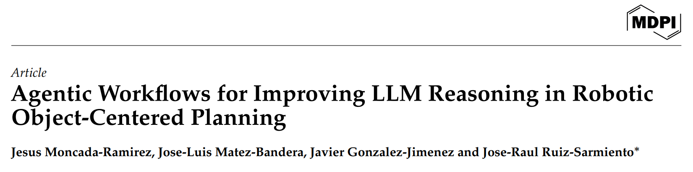

# mdpi-reflection

Code repository for the work "Agentic Workflows for Improving LLM Reasoning in Robotic Object-Centered Planning", presented to MDPI Robotics.



## Abstract

Large Language Models (LLMs) provide cognitive capabilities that enable robots to interpret and reason about their workspace, especially when paired with semantically rich representations like semantic maps.
However, these models are prone to generating inaccurate or invented responses, known as hallucinations, that can produce an erratic robotic operation.
This can be addressed by employing agentic workflows, structured processes that guide and refine the model's output to improve response quality.
This work formally defines and qualitatively analyzes the impact of three agentic workflows (LLM Ensemble, Self-Reflection, and Multi-Agent Reflection) on enhancing the reasoning capabilities of an LLM guiding a robotic system to perform object-centered planning.
In this context, the LLM is provided with a pre-built semantic map of the environment and a query, 
to which it must respond by determining the most relevant objects for the query.
This response can be used in a multitude of downstream tasks.
Extensive experiments were carried out employing state-of-the-art LLMs and semantic maps generated from the widely-used datasets ScanNet and SceneNN.
Results show that agentic workflows significantly enhance object retrieval performance, especially in scenarios requiring complex reasoning, with improvements averaging up to 10% over the baseline.

## Installation

1. Clone the repository:
    ```sh
    git clone <repository-url>
    cd mdpi-reflection
    ```

2. Set up the virtual environment:
    ```sh
    python -m venv virtual_environment
    source virtual_environment/Scripts/activate  # On Windows
    # source virtual_environment/bin/activate    # On Unix or MacOS
    ```

3. Install the required dependencies:
    ```sh
    pip install -r requirements.txt
    ```

## Directory Structure

- [credentials](http://_vscodecontentref_/1): Contains JSON files for authentication.
- [data](http://_vscodecontentref_/2): Contains input data files such as queries and responses.
- [results](http://_vscodecontentref_/3): Contains output results from the experiments.
- [src](http://_vscodecontentref_/4): Contains the source code for the project.
  - [annotate.py](http://_vscodecontentref_/5): Script for annotation.
  - [compare/](http://_vscodecontentref_/6): Directory for comparison scripts.
  - [constants.py](http://_vscodecontentref_/7): Contains constant values used in the project.
  - [evaluate.py](http://_vscodecontentref_/8): Script for evaluation.
  - [llm/](http://_vscodecontentref_/9): Directory for LLM-related scripts.
  - `llm_test.py`: Script for testing LLMs.
  - [main.py](http://_vscodecontentref_/10): Main script to run the project.
  - [preprocess.py](http://_vscodecontentref_/11): Script for preprocessing data.
  - [prompt/](http://_vscodecontentref_/12): Directory for prompt-related scripts.
  - [results](http://_vscodecontentref_/5): Directory for result-related scripts.
  - [utils/](http://_vscodecontentref_/13): Directory for utility scripts.
  - [voxelad/](http://_vscodecontentref_/14): Directory for voxel-related scripts.
- [virtual_environment](http://_vscodecontentref_/6): Contains the virtual environment setup.

## Usage

1. Activate the virtual environment:
    ```sh
    source virtual_environment/Scripts/activate  # On Windows
    # source virtual_environment/bin/activate    # On Unix or MacOS
    ```

2. Run the main script:
    ```sh
    python src/main.py
    ```

## License

This project is licensed under the MIT License. See the LICENSE file for details.