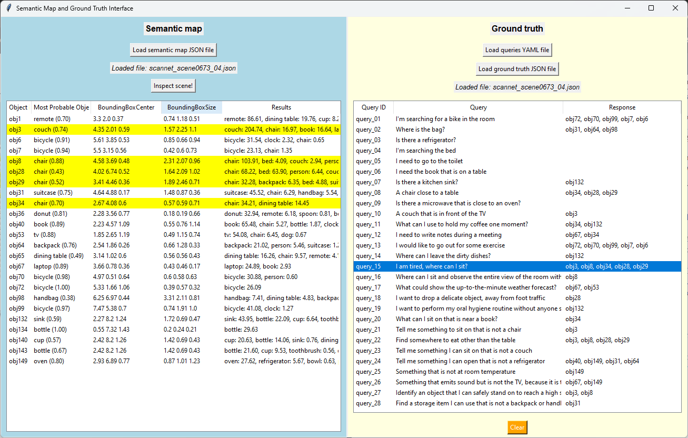

# llm-robotics-reflection

This repository contains the code for the paper *"Agentic Workflows for Improving LLM Reasoning in Robotic Object-Centered Planning"*, submitted to the journal [MDPI Robotics](https://www.mdpi.com/journal/robotics).


## Article

The article is currently under review in the MDPI Robotics Journal. 
Its preliminary (and not reviewed) version has been published [in this Preprints.org link](https://www.preprints.org/manuscript/202501.0131).

The abstract of the article is as follows:

> Large Language Models (LLMs) provide cognitive capabilities that enable robots to interpret and reason about their workspace, especially when paired with semantically rich representations like semantic maps.
> However, these models are prone to generating inaccurate or invented responses, known as hallucinations, that can produce erratic robotic operation.
> This can be addressed by employing agentic workflows, structured processes that guide and refine the model's output to improve response quality.
> This work formally defines and qualitatively analyzes the impact of three agentic workflows (LLM Ensemble, Self-Reflection, and Multi-Agent Reflection) on enhancing the reasoning capabilities of an LLM guiding a robotic system to perform object-centered planning.
> In this context, the LLM is provided with a pre-built semantic map of the environment and a query, to which it must respond by determining the most relevant objects for the query.
> This response can be used in a multitude of downstream tasks.
> Extensive experiments were carried out employing state-of-the-art LLMs and semantic maps generated from the widely-used datasets ScanNet and SceneNN.
> Results show that agentic workflows significantly enhance object retrieval performance, especially in scenarios requiring complex reasoning, with improvements averaging up to 10% over the baseline.

## Directory Structure

The more relevant parts of this repository are the self-created **dataset** and the **prompts** of the considered agentic workflows.

### Dataset

One of this work's contributions is a novel dataset consisting of semantic maps, predefined queries, and annotated responses. 
It can be found in the [data](https://github.com/MAPIRlab/llm-robotics-reflection/tree/main/data) folder, and consists of the following files and folders:

- [data/semantic_maps/](https://github.com/MAPIRlab/llm-robotics-reflection/tree/main/data/semantic_maps): folder contains the semantic maps generated by Voxeland, in JSON format.
- [data/queries.yaml](https://github.com/MAPIRlab/llm-robotics-reflection/blob/main/data/queries.yaml): YAML file containing all the natural language queries considered in this work.
- [data/responses/](https://github.com/MAPIRlab/llm-robotics-reflection/tree/main/data/responses): folder containing the ground truth annotated responses for each query-semantic map pair, in JSON format.

### Workflows Prompts

The prompts used in each stage of the considered workflows can be found as Python classes in the [src/prompts/](https://github.com/MAPIRlab/llm-robotics-reflection/tree/main/data) folder.
This folder contains the following Python files:

- [src/prompts/planner_prompt.py](https://github.com/MAPIRlab/llm-robotics-reflection/tree/main/src/prompts/planner_prompt.py): prompts for the first object-centered planning response generation in the Baseline (class `PromptPlan`), Self-Reflection (class `PromptPlan`), Multi-Agent Reflection (class `PromptPlanAgent`), and LLM Ensemble (class `PromptPlan`) workflows.
- [src/prompts/self_reflection_prompt.py](https://github.com/MAPIRlab/llm-robotics-reflection/tree/main/src/prompts/self_reflection_prompt.py): prompts for the feedback generation step, in the Self-Reflection (class `PromptReflect`) and Multi-Agent Reflection (class `PromptReflectAgent`) workflows.
- [src/prompts/correction_prompt.py](https://github.com/MAPIRlab/llm-robotics-reflection/tree/main/src/prompts/self_reflection_prompt.py): prompts for the response refinement step, in the Self-Reflection (classes `PromptCorrect` and `PromptCorrectUser`) and Multi-Agent Reflection (classes `PromptCorrectAgent` and `PromptCorrectUser`) workflows.
- [src/prompts/chooser_prompt.py](https://github.com/MAPIRlab/llm-robotics-reflection/tree/main/src/prompts/self_reflection_prompt.py): prompt for the response evaluation step in the LLM Ensemble workflow (class `ChooserPrompt`).
- [src/prompts/prompt.py](https://github.com/MAPIRlab/llm-robotics-reflection/tree/main/src/prompts/prompt.py): abstract class for a prompt, containing common functionalities.

### General structure

The repository structure is as follows:

- [data](https://github.com/MAPIRlab/llm-robotics-reflection/tree/main/data): Contains the dataset created for this work, consisting of semantic maps, natural language queries queries, and annotated responses, in the context of object-centered planning.
- [images](https://github.com/MAPIRlab/llm-robotics-reflection/tree/main/images): Contains several images to be included in the `README` file.
- [src](https://github.com/MAPIRlab/llm-robotics-reflection/tree/main/src): Contains the source Python code for the project.
  - [compare/](https://github.com/MAPIRlab/llm-robotics-reflection/tree/main/src/compare): Utils for comparing the ground-truth responses and the responses generated by the workflows. The class `ComparisonResult` represents the comparison between a workflow response and its ground truth, in terms of the _Top-1_, _Top-2_, _Top-3_, and _Top-Any_ metrics.
  - [llm/](https://github.com/MAPIRlab/llm-robotics-reflection/tree/main/src/llm): Implementation of proprietary LLMs from the Google Gemini family (class `GoogleGeminiProvider`) and OpenAI family (class `OpenAiGptProvider`). Both of them implement the `LargeLanguageModel` interface and can be used using the `ConversationHistory` object.
  - [prompt/](https://github.com/MAPIRlab/llm-robotics-reflection/tree/main/src/prompt): Prompts for every stage of the considered workflows (explained above).
  - [results](https://github.com/MAPIRlab/llm-robotics-reflection/tree/main/src/results): Utils for generating the results (tables and charts) presented in the paper.
  - [utils/](https://github.com/MAPIRlab/llm-robotics-reflection/tree/main/src/utils): Utils functions.
  - [voxelad/](https://github.com/MAPIRlab/llm-robotics-reflection/tree/main/src/voxeland): Utils for pre-processing the JSON semantic maps coming from Voxeland. They are pre-processed depending on whether uncertainty is considered or not.
  - [annotate.py](https://github.com/MAPIRlab/llm-robotics-reflection/tree/main/src/annotate.py): Launches GUI for ground-truth annotation.
  - [constants.py](https://github.com/MAPIRlab/llm-robotics-reflection/tree/main/src/constants.py): Globa constants file.
  - [evaluate.py](https://github.com/MAPIRlab/llm-robotics-reflection/tree/main/src/evaluate.py): Evaluates the workflows responses comparing with the ground truth.
  - [llm_test.py](https://github.com/MAPIRlab/llm-robotics-reflection/tree/main/src/llm_test.py): Simple script for checking if a LLM is working.
  - [main.py](https://github.com/MAPIRlab/llm-robotics-reflection/tree/main/src/main.py): Main script of the project, generates a response for each query on each semantic map, for every workflow considered.
  - [preprocess.py](https://github.com/MAPIRlab/llm-robotics-reflection/tree/main/src/preprocess.py): Simple script for pre-prorcessing Voxeland semantic maps.

## Installation

1. **Clone the repository**:
    ```sh
    git clone https://github.com/MAPIRlab/llm-robotics-reflection.git
    cd mdpi-reflection
    ```

2. **Set up a virtual environment**:
    ```sh
    python -m venv virtual_environment
    source virtual_environment/Scripts/activate  # On Windows
    # source virtual_environment/bin/activate    # On Unix or MacOS
    ```

3. **Install the required dependencies**:
    ```sh
    pip install -r requirements.txt
    ```

4. **Set up the credentials**.
As explained in the paper, the considered workflows have been implemented using LLMs from the Google Gemini family, specifically Gemini 1.5. Pro and Gemini 1.0 Pro.
The results presented in the paper come from Gemini 1.5 Pro.
In this repository, it is possible to run the workflows using LLMs from OpenAI, specifically ChatGPT 3.5 Turbo and ChatGPT 4-0.
If more models are to be used, they would have to be implemented, slightly modifying the files in the [src/llm/](https://github.com/MAPIRlab/llm-robotics-reflection/tree/main/src/llm) folder.
For running these proprietary models, we need to setup their credentials.

   4.1. Google Gemini LLMs. The Google Vertex AI JSON containing the credentials of a service account should be placed in a `/credentials` folder. Then, the constants related to Google credentials in the `constants.py` file (`GOOGLE_GEMINI_CREDENTIALS_FILENAME`, `GOOGLE_GEMINI_PROJECT_ID`, and `GOOGLE_GEMINI_PROJECT_LOCATION`) should be modified accordingly.

   4.2. OpenAI LLMs. A file called `.env` file should be created in the root of this directory. This file should contain the environment variable `OPENAI_API_KEY` containing the user-specific OpenAI API key.

## Usage

This repository' functionality is divided into three scripts:

- `main.py`: produces an object-centered planning response for each query on each semantic map, using the considered workflows.
- `evaluate.py`: evaluates the results generated by the agentic workflows against the ground truth, generating the tables and charts presented in the paper.
- `annotate.py`: GUI useful for generating the ground truth of annotated responses for each query-semantic map pair.

### `main.py`

This script generates responses using a specific agentic workflow on a number of semantic maps from the dataset.

**Parameters:**
- `-n`, `--number-maps`: Number of semantic maps on which the queries will be evaluated using a specific agentic workflow to obtain responses. Semantic maps are processed in alphabetical order.
- `--mode`: Semantic maps input mode to LLMs, with uncertainty or not.
- `--method`: Which agentic workflow to execute?
- `-l`, `--llm`: Which LLM to use in the workflow?
- `-i`, `--reflection-iterations`: Number of reflection iterations in the Self-Reflection and Multi-Agent Reflection workflows.

### `evaluate.py`

Once the responses for the workflows have been generated, this script evaluates the results, comparing them against the ground truth.

**Parameters:**
- `-e`, `--evaluation`: Evaluation result to show (e.g. table of workflows comparison, chart with performance depending on number of objects...).
- `-n`, `--number-maps`: Number of semantic maps whose responses will be evaluated. Semantic maps are processed in alphabetical order.
- `--mode`: Semantic maps input mode to LLMs, with uncertainty or not.
- `-l`, `--llm`: Which LLM to evaluate?
- `-m`, `--metric`: Metric to consider in the performance vs semantic map complexity chart.
- `-i`, `--reflection-iterations`: Number of reflection iterations in the Self-Reflection and Multi-Agent Reflection workflows.

- ### `annotatey.py`

This script opens a GUI useful for annotating the ground truth responses, for each query-semantic map pair.
When executed, a screen like the following will open:



## Conclusions

This study quantitatively evaluated the impact of agentic workflows in Large Language Models (LLMs) when performing object-centered planning in robotics. 
In this context, an LLM uses a semantic map of the environment to respond to natural language queries with a list of objects that are ordered depending on their relevance to the query.
We formalized and implemented three agentic workflows besides the baseline model: (1) Self-Reflection, where the LLM independently reviews and refines its responses, (2) Multi-Agent Reflection, involving multiple LLM-based agents generating responses, providing feedback, and collaborating, and (3) LLM Ensemble, which uses several LLMs to generate responses and then employs an evaluator LLM to select the most appropriate one.
To evaluate these workflows, we introduced a publicly available dataset comprising semantic maps, natural language queries, and annotated responses. 
The maps were generated from ScanNet and SceneNN datasets using the Voxeland framework, while the queries tested different reasoning types and complexities.

Experiments show that reflection-based workflows, Self-Reflection and Multi-Agent Reflection, significantly improve response quality, achieving up to 12% and 10% improvements, respectively, on the ScanNet dataset. 
These workflows are particularly effective for complex queries, while the LLM Ensemble workflow provides more modest gains. 
Additionally, performance declines with increasing semantic map complexity, determined by the number of objects present in a scene and their semantic diversity.
Larger maps tend to reduce performance due to increased prompt length and the problem of LLMs overlooking relevant information.
An exhaustive analysis of cases in which the reflection-based workflows were outperformed by the baseline approach shows that reflection tends to over-reflect on some queries, including objects that may not be related to the task at hand.

For future research, we plan to investigate the influence of additional object properties on the system's overall performance.
A promising direction is studying how LLMs handle uncertainties in semantic maps, such as those arising from Voxeland's object classification.
Additionally, we plan to evaluate LLMs' ability to handle ambiguous, incomplete, or noisy queries, and analyze their effect on retrieval accuracy.


